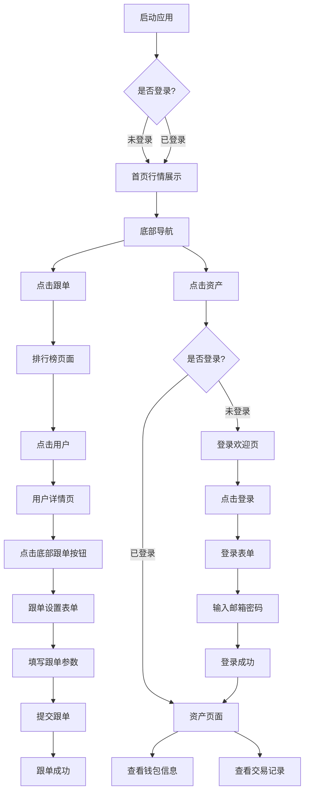
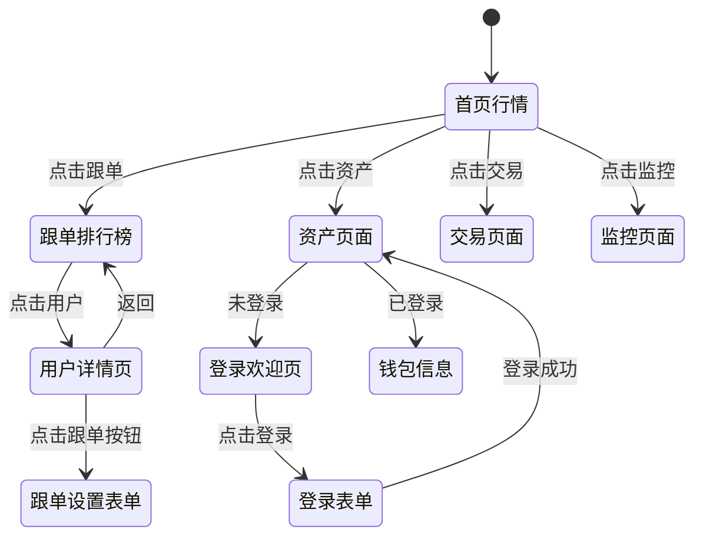

# Pixel Perfect GMGN App

这是一个基于 React + TypeScript + Vite 构建的加密货币跟单交易应用。项目实现了代币行情展示、用户排行榜、跟单功能、资产管理等核心功能。

## 项目概述

本项目是一个移动端优先的 Web 应用，采用现代化的技术栈，提供流畅的用户体验。主要功能包括：

- 📊 **首页行情展示**：实时查看代币价格、市值、涨跌幅等信息
- 🏆 **跟单排行榜**：查看交易高手排行榜，了解他们的交易表现
- 👤 **用户详情页**：查看用户的详细交易信息、持仓情况、收益分析
- 📝 **跟单设置**：配置跟单参数，包括买入设置、卖出设置、过滤条件等
- 💰 **资产管理**：查看个人钱包余额、交易记录等
- 🔐 **用户登录**：通过邮箱密码登录系统

## 技术栈

- **框架**: React 18.3.1
- **构建工具**: Vite 6.3.5
- **样式**: Tailwind CSS 4.1.12
- **UI 组件库**: Radix UI + shadcn/ui
- **语言**: TypeScript
- **状态管理**: React Hooks (useState)

## 项目结构

```
src/
├── app/
│   ├── App.tsx                 # 主应用组件，路由管理
│   ├── components/
│   │   ├── DiscoverPage.tsx    # 首页行情展示
│   │   ├── FollowPage.tsx      # 跟单页面排行榜
│   │   ├── UserDetailPage.tsx  # 用户详情页
│   │   ├── FollowFormModal.tsx # 跟单设置表单
│   │   ├── AssetsPage.tsx       # 资产页面
│   │   ├── LoginForm.tsx       # 登录表单
│   │   ├── LoginWelcome.tsx    # 登录欢迎页
│   │   ├── BottomNav.tsx       # 底部导航栏
│   │   └── ui/                 # UI 组件库
│   └── styles/                 # 样式文件
└── main.tsx                    # 应用入口
```

## 核心功能实现

### 1. 首页行情展示 (DiscoverPage)

**功能特点**：
- 代币列表展示，包含价格、市值、24小时涨跌幅、交易量、持有人数
- 搜索功能：支持代币名称和地址搜索
- 分类筛选：全部、热门、新币、AI、Meme、DeFi、Gaming 等
- 实时数据展示（当前为模拟数据）

**主要组件**：
- 搜索栏和筛选按钮
- 分类标签页
- 代币卡片列表

### 2. 跟单页面排行榜 (FollowPage)

**功能特点**：
- 排行榜展示：显示排名、头像、用户名、胜率、交易次数、收益等
- 顶部前三名特殊展示
- 点击用户卡片可进入用户详情页
- 支持查看不同时间段的排行榜

**数据展示**：
- 排名（Rank）
- 用户头像和用户名
- 胜率（Win Rate）
- 交易次数/聪明度（Trades）
- 总收益（Profit）
- 24小时变化（Change）

### 3. 用户详情页 (UserDetailPage)

**功能特点**：
- 用户基本信息：头像、用户名、收益统计
- 持仓列表：显示当前持有的代币及盈亏情况
- 收益分析：PnL 图表、交易统计
- 底部跟单按钮：点击后弹出跟单设置表单
- 返回功能：返回排行榜页面

**标签页**：
- **持仓**：显示当前持仓的代币列表
- **分析**：显示收益分析图表和统计数据

### 4. 跟单设置表单 (FollowFormModal)

**功能特点**：
- **跟单钱包地址**：显示要跟单的钱包地址
- **跟买设置**：
  - 买入类型选择（固定买入）
  - 钱包选择
  - 买入数量输入
  - 加仓次数设置
  - 不买持仓选项
- **卖出设置**：
  - 自动跟卖
  - 分批止盈止损
  - Dev 卖
  - 迁移自动卖
  - 单次止盈止损
- **过滤设置**：
  - 市值范围
  - 池子范围
  - 跟单金额范围
  - 持有人数范围
  - 跟单代币比例
  - 代币创建时间
  - 最低烧池子比例
- **平台选择**：选择支持的交易平台
- **币种黑名单**：添加不想跟单的代币地址
- **滑点限制**：设置滑点容忍度
- **费用设置**：优先费、贿赂费、防夹模式

### 5. 资产页面 (AssetsPage)

**未登录状态**：
- 显示欢迎页面（LoginWelcome）
- 提供登录和注册入口
- 点击登录后显示登录表单

**登录流程**：
- 显示登录表单（LoginForm）
- 输入邮箱和密码
- 登录成功后显示资产页面

**已登录状态**：
- 总余额展示（SOL）
- 充值、跨链/闪兑、更多操作按钮
- 钱包信息展示：
  - 钱包名称和余额
  - 钱包地址（可复制、查看外部链接）
  - 粉丝数、关注数
  - 交易记录列表
  - 资产分布

### 6. 底部导航 (BottomNav)

**导航项**：
- 🔍 发现（Discover）：首页行情
- 👥 跟单（Follow）：排行榜
- 💱 交易（Trade）：交易功能（开发中）
- 📊 监控（Monitor）：监控功能（开发中）
- 💰 资产（Assets）：个人资产

## 应用流程

### 主要用户流程



### 页面导航流程



## 运行项目

### 安装依赖

```bash
npm install
```

### 启动开发服务器

```bash
npm run dev
```

应用将在 `http://localhost:5173` 启动

### 构建生产版本

```bash
npm run build
```

## 功能状态

- ✅ 首页行情展示
- ✅ 跟单排行榜
- ✅ 用户详情页
- ✅ 跟单设置表单
- ✅ 资产页面
- ✅ 登录功能
- ✅ 钱包信息展示
- ⏳ 交易功能（开发中）
- ⏳ 监控功能（开发中）

## AI流程

通过截图,使用 `figma make` 制作：https://www.figma.com/design/IAIUK4RGJl5kW62l97IiDn/Pixel-Perfect-GMGN-App
